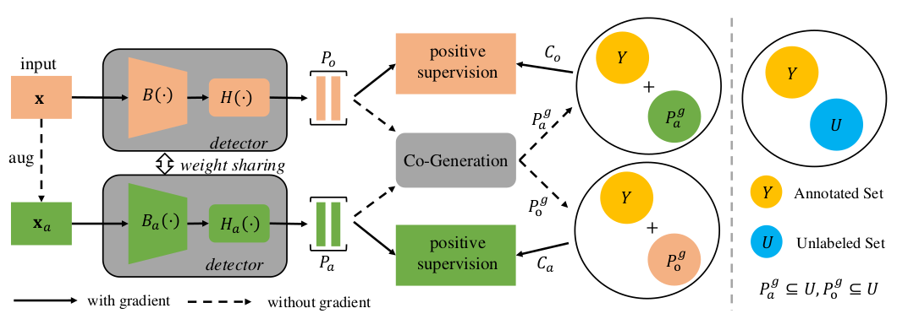

# Co-mining: Self-Supervised Learning for Sparsely Annotated Object Detection

This repository is an official implementation of the AAAI 2021 paper [Co-mining: Self-Supervised Learning for Sparsely Annotated Object Detection](https://arxiv.org/abs/2012.01950).

## Introduction

**TL; DR.** Co-ming is a self-supervised learning framework for sparsely annotated object detection.

# 

## Get Started

1. Install [cvpods](https://github.com/Megvii-BaseDetection/cvpods) following the instructions

```shell
# Install cvpods
git clone https://github.com/Megvii-BaseDetection/cvpods.git
cd cvpods 
## build cvpods (requires GPU)
python3 setup.py build develop
## preprare data path
mkdir datasets
ln -s /path/to/your/coco/dataset datasets/coco
```

2. Download the sparse-annotations from [here](https://drive.google.com/drive/folders/1jGl7IUxwJ3xRS0CcovzB7KEWMGZB555X?usp=sharing
) of four cases and put them into /coco/annotations/. Note that the annotation of "missing_50p" is from the authors of [BRL paper](https://arxiv.org/abs/2002.05274).


3. For fast evaluation, please download trained model from [here](https://drive.google.com/drive/folders/1T2I_HtHDCOu2i_iamizytwJ5VC_mivmM?usp=sharing).


3. Run the project

```shell
git clone https://github.com/megvii-research/Co-mining.git

# for example(e.g. miss50p)
cd co-mining/retinanet.res101.comining.score.06.miss50p/

# train
pods_train --num-gpus 8

# test
pods_test --num-gpus 8
# test with provided weights
pods_test --num-gpus 8 MODEL.WEIGHTS /path/to/your/model.pth
```

## Results

| Model | Multi-scale training | AP (minival) | Link |
|:--- |:--------------------:|:-------:|:---:|
| Comining_RetinaNet_Res50_Full | No | 36.8 | [download](https://drive.google.com/drive/folders/1T2I_HtHDCOu2i_iamizytwJ5VC_mivmM?usp=sharing)
| Comining_RetinaNet_Res50_Easy | No | 35.4 | [download](https://drive.google.com/drive/folders/1T2I_HtHDCOu2i_iamizytwJ5VC_mivmM?usp=sharing)
| Comining_RetinaNet_Res50_Hard | No | 31.8 | [download](https://drive.google.com/drive/folders/1T2I_HtHDCOu2i_iamizytwJ5VC_mivmM?usp=sharing)
| Comining_RetinaNet_Res50_Extreme | No | 23.0 | [download](https://drive.google.com/drive/folders/1T2I_HtHDCOu2i_iamizytwJ5VC_mivmM?usp=sharing)
| Comining_RetinaNet_Res101_Miss50p | No | 33.9 | [download](https://drive.google.com/drive/folders/1T2I_HtHDCOu2i_iamizytwJ5VC_mivmM?usp=sharing)

## Citing Co-mining
If you find Co-mining useful to your research, please consider citing:
```
@article{wang2021comining,
  title={Co-mining: Self-Supervised Learning for Sparsely Annotated Object Detection},
  author={Wang, Tiancai and Yang, Tong and Cao, Jiale and Zhang, Xiangyu},
  journal={Proceedings of the AAAI conference on artificial intelligence},
  year={2021}
}
```